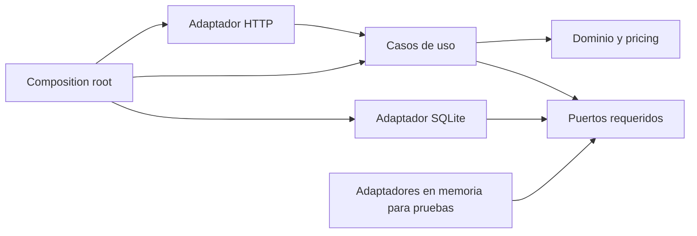

# Especificación técnica de backend - Go

## Control del documento

| Campo | Valor |
|---|---|
| Estado | Propuesta técnica para revisión |
| Versión | 1.0 |
| Aplicación | `apps/backend` |
| Lenguaje | Go |
| Estilo arquitectónico | Monolito modular con puertos y adaptadores |
| Especificación funcional | [`product-specification.md`](../../../docs/specs/product-specification.md) |
| Historias de usuario | [`user-stories.md`](../../../docs/specs/user-stories.md) |

## 1. Propósito

Esta especificación define cómo construir el backend del MVP de checkout. Su objetivo es convertir los requisitos funcionales en una solución Go pequeña, idiomática, comprobable y segura frente a concurrencia, sin introducir infraestructura distribuida ni abstracciones que el dominio no necesita.

El backend es la fuente de verdad para catálogo, precios, categorías, stock, cupones, descuentos y órdenes. El cliente nunca decide el total definitivo.

## 2. Alcance técnico

El servicio debe ofrecer:

- Consulta del catálogo.
- Cotización no vinculante del carrito.
- Confirmación idempotente del checkout.
- Motor de descuentos secuencial y determinista.
- Validación y decremento atómico de inventario.
- Persistencia de órdenes y claves de idempotencia.
- Contratos JSON estables y versionados.
- Errores de dominio traducidos a HTTP.
- Logs estructurados, correlación y apagado ordenado.
- Pruebas unitarias, de integración y concurrencia.

No se requieren autenticación, pagos, impuestos, envíos, microservicios, colas ni caché distribuida.

## 3. Decisiones rectoras

### 3.1 Monolito modular

Una única aplicación es suficiente para el MVP. La modularidad se obtiene por paquetes y fronteras de dominio, no por procesos separados.

Beneficios:

- Transacciones locales para stock y órdenes.
- Menor superficie operacional.
- Ejecución y pruebas sencillas.
- Separación interna que permite sustituir persistencia o transporte.

### 3.2 Dependencias hacia el dominio

El dominio y el motor de precios no deben importar HTTP, SQL, logging ni configuración. La composición de dependencias ocurre únicamente en `cmd/api/main.go`.



### 3.3 Abstracciones mínimas

- Definir interfaces en el paquete que las consume.
- Mantener interfaces pequeñas y orientadas al caso de uso.
- No crear una interfaz por cada struct.
- Preferir funciones puras para cálculos.
- No utilizar un contenedor de inyección de dependencias; constructores explícitos son suficientes.

### 3.4 Persistencia

Decisión recomendada para aprobar DR-09 y DR-10:

- SQLite como adaptador real del MVP.
- `database/sql` como API de acceso.
- Migraciones SQL versionadas.
- Una transacción para validar stock, actualizarlo, guardar la orden y registrar idempotencia.
- Repositorios en memoria únicamente para pruebas unitarias.

SQLite conserva órdenes entre reinicios y permite demostrar atomicidad sin desplegar un servidor de base de datos.

## 4. Stack recomendado

| Área | Elección | Criterio |
|---|---|---|
| HTTP | `net/http` + `chi` | Router pequeño sobre primitivas estándar. |
| JSON | `encoding/json` | Suficiente para contratos del MVP. |
| Persistencia | `database/sql` + driver SQLite | Transacciones y bajo costo operacional. |
| IDs | UUID | Identificadores opacos para órdenes y solicitudes. |
| Configuración | Variables de entorno | Portabilidad y separación de configuración. |
| Logging | Logger estructurado | Campos estables, niveles y correlación. |
| Pruebas | `testing`, `httptest`, fuzzing nativo | Herramientas estándar y rápidas. |
| Migraciones | SQL embebido o comando explícito | Esquema reproducible y versionado. |

No se debe incorporar un ORM para este alcance. Las consultas son pequeñas y la lógica crítica debe permanecer visible.

## 5. Estructura de paquetes

```text
apps/backend/
├── cmd/
│   └── api/
│       └── main.go
├── internal/
│   ├── catalog/
│   │   ├── product.go
│   │   ├── repository.go
│   │   └── service.go
│   ├── pricing/
│   │   ├── engine.go
│   │   ├── rule.go
│   │   ├── category_rule.go
│   │   ├── volume_rule.go
│   │   ├── coupon_rule.go
│   │   ├── cap_rule.go
│   │   └── money.go
│   ├── checkout/
│   │   ├── command.go
│   │   ├── service.go
│   │   ├── order.go
│   │   ├── ports.go
│   │   └── errors.go
│   ├── platform/
│   │   ├── config/
│   │   ├── logging/
│   │   └── clock/
│   └── adapters/
│       ├── httpapi/
│       │   ├── router.go
│       │   ├── catalog_handler.go
│       │   ├── quote_handler.go
│       │   ├── checkout_handler.go
│       │   ├── middleware.go
│       │   ├── request.go
│       │   ├── response.go
│       │   └── errors.go
│       ├── sqlite/
│       │   ├── store.go
│       │   ├── catalog_repository.go
│       │   ├── order_repository.go
│       │   └── transaction.go
│       └── memory/
│           └── repositories.go
├── migrations/
│   ├── 001_initial.up.sql
│   └── 001_initial.down.sql
├── testdata/
├── go.mod
├── go.sum
├── Makefile
└── Dockerfile
```

Los nombres pueden variar, pero deben preservarse las fronteras: transporte, aplicación, dominio/pricing y persistencia.

## 6. Modelo de dominio

### 6.1 Dinero

```go
type Cents int64

type Money struct {
    Amount   Cents
    Currency Currency
}
```

Reglas:

- `Amount` nunca utiliza `float32` o `float64`.
- La moneda del MVP es `USD`.
- Los valores monetarios negativos son inválidos, salvo que un tipo específico los permita.
- Las operaciones deben comprobar overflow antes de multiplicar.
- El redondeo propuesto para DR-05 es `ROUND_HALF_UP` después de cada regla.

Para importes positivos, un porcentaje entero puede redondearse así:

```text
rounded = (amount * percentage + 50) / 100
```

La implementación debe encapsular esta operación y probar límites; no debe repetirse aritmética monetaria en handlers o repositorios.

### 6.2 Producto

```go
type Category string

const CategoryTechnology Category = "TECHNOLOGY"

type Product struct {
    ID        ProductID
    Name      string
    UnitPrice Money
    Category  Category
    Stock     int
}
```

La categoría utiliza un valor canónico (`TECHNOLOGY`) independiente del texto localizado que muestra el frontend.

### 6.3 Línea solicitada

```go
type RequestedItem struct {
    ProductID ProductID
    Quantity  int
}
```

Validaciones:

- Lista no vacía.
- ID no vacío.
- Cantidad entera entre 1 y el máximo aprobado en DR-07.
- IDs duplicados consolidados antes de consultar stock.

### 6.4 Cupón

```go
type CouponStatus string

const (
    CouponApplied  CouponStatus = "APPLIED"
    CouponNotFound CouponStatus = "NOT_FOUND"
    CouponExpired  CouponStatus = "EXPIRED"
    CouponOmitted  CouponStatus = "OMITTED"
)
```

Decisión propuesta para DR-04:

```text
normalizedCode = strings.ToUpper(strings.TrimSpace(input))
```

Un cupón rechazado no invalida la compra: su descuento es cero y su estado se comunica en la cotización y en el checkout.

### 6.5 Desglose

```go
type Breakdown struct {
    OriginalSubtotal          Cents
    CategoryDiscount          Cents
    AfterCategory             Cents
    VolumeDiscount            Cents
    AfterVolume               Cents
    CouponDiscount            Cents
    CalculatedSavings         Cents
    MaximumSavings            Cents
    FinalSavings              Cents
    EffectiveDiscountMilliPercent int32
    LimitApplied              bool
    FinalTotal                Cents
    Currency                  Currency
}
```

El porcentaje efectivo puede conservarse en milésimas de punto porcentual (`27.325%` se representa como `27325`) o derivarse para serialización. Nunca se utiliza para reconstruir importes.

### 6.6 Orden

Una orden confirmada contiene:

- ID y fecha UTC.
- Estado `CONFIRMED`.
- Instantánea de cada producto: ID, nombre, categoría, precio y cantidad.
- Cupón normalizado y estado.
- Desglose definitivo.
- Clave de idempotencia asociada.

Guardar una instantánea evita que una modificación futura del catálogo cambie el significado histórico de la orden.

## 7. Motor de descuentos

### 7.1 Contrato de regla

El patrón **Strategy** representa cada descuento. Una canalización ordenada actúa como **Chain of Responsibility** determinista.

```go
type DiscountRule interface {
    Code() string
    Apply(ctx PricingContext, current Money) (RuleResult, error)
}
```

Orden obligatorio:

1. `CATEGORY_10_PERCENT`.
2. `VOLUME_5_PERCENT`.
3. `WELCOME2026_15_PERCENT`.
4. `MAXIMUM_DISCOUNT_35_PERCENT`.

El orden se configura en el composition root y se prueba explícitamente. No debe depender del orden de iteración de un map.

### 7.2 Invariantes

Para toda entrada válida:

- Ningún descuento es negativo.
- Cada total intermedio es menor o igual al anterior.
- `FinalSavings <= MaximumSavings`.
- `FinalTotal = OriginalSubtotal - FinalSavings`.
- `FinalTotal >= 0`.
- Una regla no muta productos ni stock.
- El motor es puro respecto a persistencia y reloj.

### 7.3 Regla de categoría

```text
technologySubtotal = suma de líneas TECHNOLOGY
categoryDiscount = roundHalfUp(technologySubtotal * 10%)
afterCategory = originalSubtotal - categoryDiscount
```

### 7.4 Regla de volumen

```text
volumeDiscount = afterCategory > USD 100.00
    ? roundHalfUp(afterCategory * 5%)
    : 0
afterVolume = afterCategory - volumeDiscount
```

USD 100.00 exactos no activan la regla.

### 7.5 Regla de cupón

```text
couponDiscount = couponStatus == APPLIED
    ? roundHalfUp(afterVolume * 15%)
    : 0
calculatedTotal = afterVolume - couponDiscount
```

### 7.6 Límite

```text
calculatedSavings = originalSubtotal - calculatedTotal
maximumSavings = roundHalfUp(originalSubtotal * 35%)
finalSavings = min(calculatedSavings, maximumSavings)
finalTotal = originalSubtotal - finalSavings
limitApplied = calculatedSavings > maximumSavings
```

DR-01 continúa bloqueada: las reglas actuales alcanzan como máximo 27.325%. La implementación debe soportar el límite y probarlo mediante una regla/configuración controlada, pero no alterar porcentajes de producción sin aprobación.

## 8. Casos de uso

### 8.1 ListProducts

1. Consulta el catálogo.
2. Ordena la respuesta de forma determinista.
3. Devuelve productos disponibles, incluidos los de stock cero.

### 8.2 QuoteCart

1. Valida y consolida las líneas.
2. Carga productos autoritativos.
3. Valida existencia y cantidades; el stock puede informarse, pero la cotización no lo reserva.
4. Resuelve el estado del cupón usando un reloj inyectable.
5. Ejecuta el motor.
6. Devuelve una cotización no vinculante y su instante UTC.

La respuesta debe indicar que el stock y los importes serán recalculados al confirmar.

### 8.3 Checkout

1. Valida formato, líneas e idempotency key.
2. Busca un resultado previo para esa clave.
3. Si existe con el mismo hash de solicitud, devuelve la respuesta previa.
4. Si existe con otra solicitud, responde conflicto.
5. Inicia una transacción.
6. Carga y valida los productos dentro de la transacción.
7. Consolida cantidades y asegura stock suficiente.
8. Resuelve el cupón y recalcula el desglose.
9. Decrementa cada stock mediante actualización condicional.
10. Inserta la orden y sus líneas.
11. Registra clave de idempotencia, hash y respuesta estable.
12. Confirma la transacción.
13. Devuelve `201 Created`.

Ante cualquier fallo antes del commit, se ejecuta rollback y no queda estado parcial.

## 9. API HTTP

### 9.1 Convenciones

- Prefijo: `/api/v1`.
- JSON UTF-8.
- Campos JSON en `camelCase`.
- Fechas en RFC 3339 UTC.
- Importes monetarios en centavos enteros.
- `Content-Type: application/json`.
- Máximo del body: 1 MiB.
- Rechazar campos JSON desconocidos.
- Un único valor JSON por body; rechazar contenido adicional.
- Cada respuesta incluye `X-Request-ID`.

### 9.2 `GET /api/v1/products`

Respuesta `200 OK`:

```json
{
  "products": [
    {
      "id": "prod-001",
      "name": "Teclado mecánico",
      "unitPrice": 12000,
      "currency": "USD",
      "category": "TECHNOLOGY",
      "stock": 5
    }
  ]
}
```

### 9.3 `POST /api/v1/checkout/quote`

Solicitud:

```json
{
  "items": [
    { "productId": "prod-001", "quantity": 1 }
  ],
  "couponCode": "WELCOME2026"
}
```

Respuesta `200 OK`:

```json
{
  "quotedAt": "2026-09-08T15:00:00Z",
  "items": [
    {
      "productId": "prod-001",
      "name": "Teclado mecánico",
      "category": "TECHNOLOGY",
      "unitPrice": 12000,
      "quantity": 1,
      "lineAmount": 12000
    }
  ],
  "coupon": {
    "code": "WELCOME2026",
    "status": "APPLIED"
  },
  "breakdown": {
    "originalSubtotal": 12000,
    "categoryDiscount": 1200,
    "afterCategory": 10800,
    "volumeDiscount": 540,
    "afterVolume": 10260,
    "couponDiscount": 1539,
    "calculatedSavings": 3279,
    "maximumSavings": 4200,
    "finalSavings": 3279,
    "effectiveDiscountPercentage": 27.325,
    "limitApplied": false,
    "finalTotal": 8721,
    "currency": "USD"
  },
  "binding": false
}
```

### 9.4 `POST /api/v1/checkout`

Headers:

```http
Idempotency-Key: 018fc86b-2c10-7b91-bf44-1f8f554d32af
```

Body: el mismo contrato de entrada de la cotización.

Respuesta `201 Created`:

```json
{
  "orderId": "ord-001",
  "status": "CONFIRMED",
  "createdAt": "2026-09-08T15:01:00Z",
  "items": [],
  "coupon": {
    "code": "WELCOME2026",
    "status": "APPLIED"
  },
  "breakdown": {},
  "links": {
    "self": "/api/v1/orders/ord-001"
  }
}
```

Un reintento con la misma clave y el mismo payload devuelve la misma orden con `200 OK` y no vuelve a descontar stock.

### 9.5 `GET /health/live` y `GET /health/ready`

- `live`: confirma que el proceso responde.
- `ready`: comprueba que la persistencia está disponible y las migraciones requeridas están aplicadas.

No deben incluir información sensible.

## 10. Contrato de errores

```json
{
  "error": {
    "code": "INSUFFICIENT_STOCK",
    "message": "Uno o más productos no tienen stock suficiente.",
    "requestId": "req-123",
    "details": [
      {
        "field": "items[0].quantity",
        "productId": "prod-001",
        "available": 1,
        "requested": 2
      }
    ]
  }
}
```

| HTTP | Código | Uso |
|---:|---|---|
| 400 | `INVALID_JSON` | JSON mal formado o campos desconocidos. |
| 422 | `EMPTY_CART` | No hay líneas. |
| 422 | `INVALID_QUANTITY` | Cantidad fuera del dominio. |
| 404 | `PRODUCT_NOT_FOUND` | Producto inexistente. |
| 409 | `INSUFFICIENT_STOCK` | Stock vigente insuficiente. |
| 409 | `IDEMPOTENCY_CONFLICT` | La clave ya existe con otro payload. |
| 500 | `ORDER_PERSISTENCE_FAILED` | Fallo no recuperable al confirmar. |
| 503 | `SERVICE_UNAVAILABLE` | Persistencia temporalmente no disponible. |

`COUPON_NOT_FOUND` y `COUPON_EXPIRED` son estados de negocio no bloqueantes dentro de una respuesta válida, no errores HTTP del checkout.

No exponer mensajes SQL, stack traces ni detalles internos.

## 11. Persistencia y concurrencia

### 11.1 Esquema mínimo

```text
products(id, name, unit_price, currency, category, stock, version)
coupons(code, percentage, active_from, expires_at, enabled)
orders(id, status, created_at, coupon_code, coupon_status, breakdown_json)
order_items(order_id, product_id, name, category, unit_price, quantity, line_amount)
idempotency_keys(key, request_hash, order_id, created_at)
schema_migrations(version, applied_at)
```

### 11.2 Actualización de stock

Dentro de la transacción:

```sql
UPDATE products
SET stock = stock - ?, version = version + 1
WHERE id = ? AND stock >= ?;
```

Cada actualización debe afectar exactamente una fila. Si afecta cero, la transacción falla con `INSUFFICIENT_STOCK`.

### 11.3 Unidad de trabajo

El caso de uso debe recibir una abstracción transaccional pequeña, por ejemplo:

```go
type Transactor interface {
    WithinTransaction(ctx context.Context, fn func(ctx context.Context) error) error
}
```

Los repositorios resuelven la transacción desde el contexto o reciben un executor; nunca se mezclan llamadas a `sql.DB` con `sql.Tx` dentro de la misma operación.

### 11.4 Idempotencia

- La clave es obligatoria para checkout.
- Longitud máxima: 128 caracteres.
- Se almacena un hash canónico del payload consolidado.
- Misma clave + mismo hash: devolver la orden previa.
- Misma clave + distinto hash: `409 IDEMPOTENCY_CONFLICT`.
- La escritura de idempotencia participa en la misma transacción que la orden.

## 12. Configuración

Variables propuestas:

| Variable | Requerida | Default local | Descripción |
|---|---:|---|---|
| `HTTP_ADDR` | No | `:8080` | Dirección de escucha. |
| `DATABASE_URL` | Sí fuera de test | `file:ecommerce.db` | Conexión SQLite. |
| `CORS_ALLOWED_ORIGINS` | No | `http://localhost:5173` | Orígenes permitidos. |
| `LOG_LEVEL` | No | `info` | Nivel de logging. |
| `READ_TIMEOUT` | No | `5s` | Timeout de lectura. |
| `WRITE_TIMEOUT` | No | `10s` | Timeout de respuesta. |
| `SHUTDOWN_TIMEOUT` | No | `10s` | Gracia de apagado. |

La configuración se valida al iniciar. Ante un valor inválido, el proceso termina con un mensaje accionable.

## 13. Seguridad y robustez

- Limitar tamaño de body antes de decodificar.
- Rechazar campos desconocidos y cuerpos con múltiples documentos JSON.
- Validar longitud del cupón, IDs y número máximo de líneas.
- No confiar en precios, categorías, stock, descuentos ni totales enviados por el cliente.
- Utilizar parámetros SQL, nunca concatenación.
- Configurar CORS con orígenes explícitos.
- Añadir timeouts al servidor HTTP y propagar `context.Context`.
- No registrar bodies completos, claves de idempotencia ni datos potencialmente sensibles.
- Responder con mensajes seguros y códigos estables.
- Ejecutar como usuario no privilegiado en el contenedor.
- Fijar versiones de dependencias y revisar vulnerabilidades.

## 14. Observabilidad

### Logs estructurados

Campos mínimos:

- `timestamp`, `level`, `message`.
- `request_id`, `method`, `path`, `status`, `duration_ms`.
- `order_id` cuando exista.
- `error_code` para fallos esperados.

Nunca registrar el stack como sustituto de un código de error de dominio.

### Métricas deseables

- Total y duración de requests por ruta y estado.
- Cotizaciones y checkouts exitosos/fallidos.
- Conflictos de stock.
- Reintentos idempotentes.
- Fallos de persistencia.

Las métricas no son obligatorias para el MVP si ponen en riesgo la entrega, pero la estructura no debe impedir añadirlas.

## 15. Estrategia de pruebas

### 15.1 Pruebas unitarias

- Table-driven tests para cada regla y combinación.
- Pruebas del motor sin HTTP ni base de datos.
- Pruebas de validadores y normalización.
- Reloj e ID generator inyectables.
- Fakes escritos a mano y pequeños; evitar frameworks de mocks innecesarios.

Casos monetarios obligatorios:

- Carrito vacío.
- Solo Tecnología.
- Carrito mixto.
- USD 100.00 y USD 100.01 después de categoría.
- Cupón aplicado, omitido, inexistente y expirado.
- Fracciones de centavo.
- Tope exacto, por debajo y por encima mediante configuración de prueba.
- Invariantes de totales.

### 15.2 Pruebas HTTP

Con `httptest`:

- Contrato y códigos de cada endpoint.
- Content-Type.
- Campos desconocidos y JSON inválido.
- Cuerpo excesivo.
- Mapeo de errores.
- Request ID.

### 15.3 Pruebas de integración

- Base SQLite temporal y migraciones reales.
- Commit de una orden válida.
- Rollback ante stock insuficiente o fallo de inserción.
- Idempotencia con mismo y distinto payload.
- Dos checkouts concurrentes sobre la última unidad.

### 15.4 Fuzzing y carreras

- Fuzz del decodificador/validador de líneas.
- Fuzz de operaciones monetarias e invariantes del motor.
- `go test -race ./...` para repositorios en memoria y pruebas concurrentes.

### 15.5 Cobertura

- Mínimo 80% en `pricing`, `checkout` y validaciones.
- La cobertura es una señal, no reemplaza aserciones de dominio.
- Handlers triviales pueden tener menor prioridad que motor, stock y atomicidad.

## 16. Quality gates

Comandos requeridos en CI y documentados en el README:

```bash
gofmt -w .
go vet ./...
go test ./...
go test -race ./...
go test -coverprofile=coverage.out ./...
go tool cover -func=coverage.out
go build ./cmd/api
```

El pipeline falla si:

- El código no está formateado.
- Falla `go vet`, build, pruebas o detector de carreras.
- Las capas lógicas esenciales quedan por debajo del 80% acordado.
- Las migraciones no se aplican sobre una base vacía.

## 17. Rendimiento y operación

Objetivos razonables para el MVP local:

- Catálogo y cotización: p95 menor de 200 ms sin carga significativa.
- Checkout: p95 menor de 500 ms con SQLite local.
- Ninguna goroutine sin ciclo de vida y cancelación definidos.
- Apagado ordenado con espera de requests en curso.
- Binario reproducible y contenedor con healthcheck.

No optimizar antes de medir. La consistencia de la orden tiene prioridad sobre throughput.

## 18. Trazabilidad

| Capacidad | Historia | Componentes backend |
|---|---|---|
| Catálogo | HU-01 | `catalog`, handler de productos, repositorio. |
| Carrito provisional | HU-01 | Contrato de productos; el estado vive en frontend. |
| Cotización y cupón | HU-02 | `pricing`, resolver de cupones, quote handler. |
| Checkout consistente | HU-03 | Caso de uso checkout, transactor, inventario y órdenes. |
| Límite y bandera | HU-04 | Regla cap y campos de `Breakdown`. |

## 19. Secuencia recomendada

1. Aprobar DR-02 a DR-10 y conservar DR-01 como bloqueo visible.
2. Definir tipos de dominio y contratos HTTP.
3. Implementar `Money` y el motor con pruebas.
4. Implementar catálogo y cotización.
5. Crear esquema SQLite y migraciones.
6. Implementar checkout transaccional e idempotente.
7. Añadir adaptadores HTTP, middleware y errores.
8. Ejecutar pruebas de integración, carreras y cobertura.
9. Validar contrato con frontend.

## 20. Definition of Done

- Los tres endpoints funcionales cumplen sus contratos.
- Precios y stock siempre se resuelven en backend.
- El motor respeta precedencia, redondeo e invariantes.
- Checkout, stock, orden e idempotencia son atómicos.
- Los errores tienen códigos estables y no filtran detalles internos.
- Todas las rutas propagan contexto y tienen timeouts.
- Las pruebas críticas alcanzan al menos 80% de cobertura.
- `go test -race ./...` pasa.
- Migraciones, configuración y comandos están documentados.
- HU-04 permanece marcada como bloqueada hasta resolver DR-01.

## 21. Referencias técnicas

- [Organización oficial de módulos y servidores Go](https://go.dev/doc/modules/layout).
- [Transacciones con `database/sql`](https://go.dev/doc/database/execute-transactions).
- [Detector de carreras de Go](https://go.dev/doc/articles/race_detector).
- [Fuzzing nativo de Go](https://go.dev/doc/security/fuzz/).
- [Effective Go](https://go.dev/doc/effective_go).
