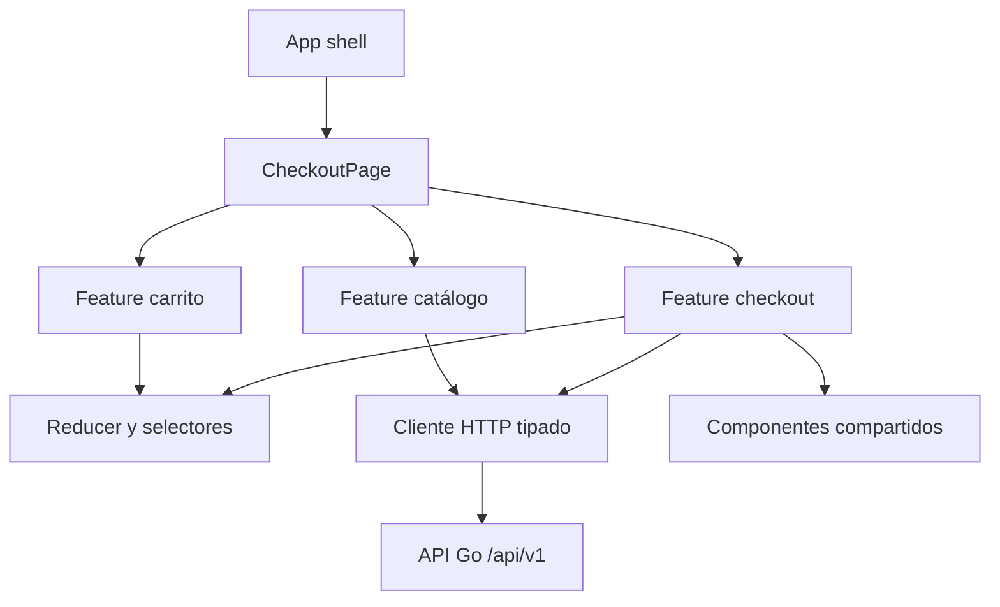
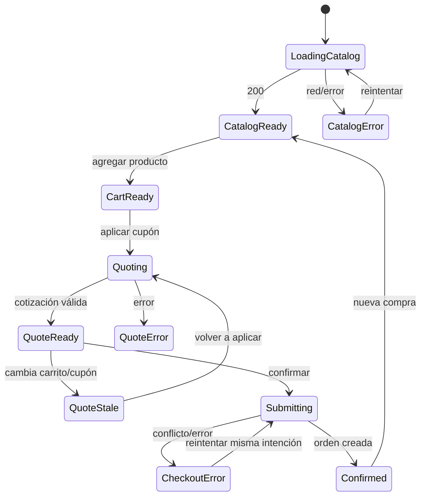

# Especificación técnica de frontend - React

## Control del documento

| Campo | Valor |
|---|---|
| Estado | Propuesta técnica para revisión |
| Versión | 1.0 |
| Aplicación | `apps/frontend` |
| Stack | React + TypeScript + Vite |
| Estilo arquitectónico | Arquitectura por funcionalidades |
| Especificación funcional | [`especificacion_producto.md`](../../../docs/specs/especificacion_producto.md) |
| Historias de usuario | [`historias_de_usuario.md`](../../../docs/specs/historias_de_usuario.md) |
| Contrato backend | [`especificacion_backend.md`](../../backend/docs/especificacion_backend.md) |

## 1. Propósito

Esta especificación define cómo construir la interfaz del MVP de checkout como una aplicación React accesible, responsiva, estrictamente tipada y orientada al comportamiento del usuario.

El frontend administra la intención de compra y la experiencia visual. No es la fuente de verdad de precios, stock, cupones ni descuentos. Puede mostrar cálculos provisionales, pero siempre debe presentar como definitivos los valores devueltos por el backend.

## 2. Alcance técnico

La aplicación debe cubrir:

- Carga y presentación del catálogo.
- Gestión local del carrito.
- Subtotal provisional inmediato.
- Aplicación de cupón y cotización remota.
- Visualización detallada de descuentos.
- Confirmación idempotente del checkout.
- Manejo explícito de carga, vacío, éxito, error y datos obsoletos.
- Alerta persistente del límite cuando el backend indique `limitApplied`.
- Accesibilidad por teclado y tecnologías de asistencia.
- Pruebas unitarias, de componentes e integración de UI.

No incluye autenticación, pago real, routing complejo, administración ni renderizado del lado del servidor.

## 3. Principios de diseño

### 3.1 Estado mínimo y derivado

- Guardar únicamente el estado que no pueda derivarse.
- Derivar subtotal, número de unidades y disponibilidad de acciones desde catálogo + carrito.
- No duplicar `subtotal` como estado mutable.
- No usar Effects para transformar estado destinado al render.
- Utilizar Effects solo para sincronización con sistemas externos, como cargar el catálogo.
- Ejecutar cotización y checkout desde sus eventos explícitos.

### 3.2 Estado local y remoto separados

| Tipo de estado | Ejemplos | Responsable |
|---|---|---|
| Local de dominio UI | Cantidades del carrito, cupón escrito | Reducer del flujo de checkout |
| Remoto | Catálogo, cotización, orden confirmada | Hooks de API con estados discriminados |
| Derivado | Subtotal provisional, cantidad total, `canCheckout` | Selectores puros |
| Efímero | Foco, sección expandida | Componente propietario |

### 3.3 Backend autoritativo

- El cliente envía IDs y cantidades, nunca precios como autoridad.
- Los descuentos visibles provienen de `breakdown`.
- La alerta del límite depende de `limitApplied`, no de comparaciones locales.
- El checkout recalculado puede diferir de la cotización y reemplaza sus importes.

### 3.4 Dependencias proporcionales

Para este MVP se recomienda:

- `useReducer` y Context a nivel de la página de checkout.
- `fetch` encapsulado en un cliente HTTP pequeño.
- Un validador de esquemas ligero, como Zod, exclusivamente en las fronteras HTTP.
- Vitest y React Testing Library.
- Mock Service Worker para pruebas de integración de red.
- `@testing-library/user-event` para interacción realista.

No se requiere Redux, Zustand ni una librería de server state mientras exista una sola pantalla y tres operaciones remotas. Si el producto crece, esa decisión puede revisarse con evidencia.

## 4. Arquitectura



Reglas de dependencia:

- `app` compone features y configuración.
- Una feature puede usar `shared`, pero `shared` no importa features.
- Los componentes visuales no llaman directamente a `fetch`.
- El cliente HTTP no importa React.
- Reducers, selectores y formatters son funciones puras.
- No crear archivos índice globales que oculten ciclos; usar exports locales y explícitos.

## 5. Estructura propuesta

```text
apps/frontend/
├── public/
├── src/
│   ├── app/
│   │   ├── App.tsx
│   │   ├── AppErrorBoundary.tsx
│   │   └── config.ts
│   ├── pages/
│   │   └── checkout/
│   │       ├── CheckoutPage.tsx
│   │       └── CheckoutPage.module.css
│   ├── features/
│   │   ├── catalog/
│   │   │   ├── api/getProducts.ts
│   │   │   ├── model/types.ts
│   │   │   ├── model/useProducts.ts
│   │   │   └── ui/ProductList.tsx
│   │   ├── cart/
│   │   │   ├── model/cartReducer.ts
│   │   │   ├── model/cartSelectors.ts
│   │   │   ├── model/cartTypes.ts
│   │   │   ├── model/CartProvider.tsx
│   │   │   └── ui/CartSummary.tsx
│   │   └── checkout/
│   │       ├── api/quoteCart.ts
│   │       ├── api/submitCheckout.ts
│   │       ├── model/checkoutTypes.ts
│   │       ├── model/useQuote.ts
│   │       ├── model/useCheckout.ts
│   │       ├── ui/CouponForm.tsx
│   │       ├── ui/PricingBreakdown.tsx
│   │       ├── ui/DiscountLimitAlert.tsx
│   │       └── ui/OrderConfirmation.tsx
│   ├── shared/
│   │   ├── api/httpClient.ts
│   │   ├── api/apiError.ts
│   │   ├── lib/money.ts
│   │   ├── lib/requestFingerprint.ts
│   │   ├── ui/Alert.tsx
│   │   ├── ui/Button.tsx
│   │   ├── ui/Spinner.tsx
│   │   └── styles/tokens.css
│   ├── test/
│   │   ├── server.ts
│   │   ├── handlers.ts
│   │   └── renderApp.tsx
│   ├── main.tsx
│   └── setupTests.ts
├── index.html
├── package.json
├── tsconfig.json
├── vite.config.ts
└── vitest.config.ts
```

La estructura se crea según necesidad. No deben generarse archivos vacíos para simular arquitectura.

## 6. Configuración de TypeScript

`strict` es obligatorio. Configuración recomendada:

```json
{
  "compilerOptions": {
    "strict": true,
    "noUncheckedIndexedAccess": true,
    "exactOptionalPropertyTypes": true,
    "noImplicitOverride": true,
    "noFallthroughCasesInSwitch": true,
    "noUnusedLocals": true,
    "noUnusedParameters": true,
    "useUnknownInCatchVariables": true
  }
}
```

Reglas:

- Prohibido `any`, excepto una excepción documentada y aislada.
- Los errores capturados son `unknown` y se estrechan explícitamente.
- Usar uniones discriminadas para estados asíncronos.
- Validar respuestas externas en runtime; el type assertion no valida JSON.
- No utilizar enums numéricos para contratos HTTP; preferir uniones literales.

## 7. Contratos de dominio de UI

### 7.1 Producto

```ts
export type Currency = 'USD'
export type Category = 'TECHNOLOGY' | 'OTHER'

export interface Product {
  id: string
  name: string
  unitPrice: number // centavos enteros
  currency: Currency
  category: Category
  stock: number
}
```

Todo importe recibido debe validarse como entero seguro no negativo.

### 7.2 Carrito

```ts
export interface CartLine {
  productId: string
  quantity: number
}

export interface CartState {
  lines: Readonly<Record<string, CartLine>>
  revision: number
}

export type CartAction =
  | { type: 'itemAdded'; productId: string; knownStock: number }
  | { type: 'itemDecremented'; productId: string }
  | { type: 'itemRemoved'; productId: string }
  | { type: 'cartCleared' }
```

El reducer debe ser puro, rechazar transiciones inválidas y devolver el mismo objeto cuando una acción no produce cambios.

### 7.3 Cupón

```ts
export type CouponStatus =
  | 'APPLIED'
  | 'NOT_FOUND'
  | 'EXPIRED'
  | 'OMITTED'

export interface CouponResult {
  code: string | null
  status: CouponStatus
}
```

El valor escrito en el input y el resultado validado son estados distintos. Escribir un nuevo código invalida visualmente el resultado anterior hasta volver a aplicarlo.

### 7.4 Desglose

```ts
export interface PricingBreakdown {
  originalSubtotal: number
  categoryDiscount: number
  afterCategory: number
  volumeDiscount: number
  afterVolume: number
  couponDiscount: number
  calculatedSavings: number
  maximumSavings: number
  finalSavings: number
  effectiveDiscountPercentage: number
  limitApplied: boolean
  finalTotal: number
  currency: Currency
}
```

La UI no recalcula estos valores. Solo los valida, formatea y presenta.

### 7.5 Estado remoto

```ts
export type RemoteData<T> =
  | { status: 'idle' }
  | { status: 'loading' }
  | { status: 'success'; data: T }
  | { status: 'error'; error: ApiError }
```

No representar carga, error y éxito con booleanos independientes que puedan producir combinaciones imposibles.

## 8. Gestión de estado

### 8.1 Carrito

El carrito utiliza `useReducer`. Context se divide para evitar renders innecesarios:

- `CartStateContext` para lectura.
- `CartDispatchContext` para comandos.

Selectores puros:

```ts
selectCartItems(state): CartLine[]
selectUnitCount(state): number
selectProvisionalSubtotal(state, products): number
selectCanQuote(state): boolean
selectCanCheckout(state, quoteState): boolean
```

### 8.2 Cotización vigente y obsoleta

Cada solicitud se asocia con una huella canónica del carrito consolidado y el cupón normalizado:

```ts
interface QuoteSuccess {
  status: 'success'
  inputFingerprint: string
  data: QuoteResponse
}
```

La cotización es vigente solo si:

```text
quote.inputFingerprint == fingerprint(currentCart, normalizedCoupon)
```

Al cambiar el carrito o cupón:

- No es necesario borrar datos mediante un Effect.
- La UI deriva que la cotización anterior está obsoleta.
- El total anterior no se etiqueta como vigente.
- El usuario debe volver a aplicar el cupón/cotizar, o la aplicación puede hacerlo explícitamente según decisión UX.

### 8.3 Checkout

El checkout posee estados exclusivos:

```ts
type CheckoutState =
  | { status: 'idle' }
  | { status: 'submitting'; idempotencyKey: string }
  | { status: 'success'; order: OrderResponse }
  | { status: 'error'; error: ApiError; retryable: boolean }
```

La misma clave de idempotencia se conserva durante reintentos del mismo intento. Se genera una nueva solo cuando el usuario inicia una compra conceptualmente nueva.

## 9. Integración HTTP

### 9.1 Configuración

```text
VITE_API_BASE_URL=http://localhost:8080/api/v1
```

La variable se valida al iniciar. No debe contener secretos: las variables `VITE_*` forman parte del bundle público.

### 9.2 Cliente HTTP

Responsabilidades de `httpClient`:

- Resolver URL base.
- Enviar y aceptar JSON.
- Adjuntar `X-Request-ID` si se genera en cliente.
- Adjuntar `Idempotency-Key` solo en checkout.
- Aplicar timeout mediante `AbortController`.
- Distinguir aborto, red, error HTTP y respuesta inválida.
- Decodificar el envelope de errores.
- Validar en runtime las respuestas exitosas.

No debe mostrar notificaciones ni importar componentes React.

### 9.3 Endpoints

| Operación | Método y ruta | Uso |
|---|---|---|
| Catálogo | `GET /api/v1/products` | Carga inicial y actualización después del checkout. |
| Cotización | `POST /api/v1/checkout/quote` | Aplicar cupón y obtener desglose no vinculante. |
| Checkout | `POST /api/v1/checkout` | Confirmar la orden con idempotencia. |

### 9.4 Solicitud común

```ts
export interface CheckoutInput {
  items: Array<{
    productId: string
    quantity: number
  }>
  couponCode?: string
}
```

Antes de enviar:

- Ordenar líneas por `productId` para una huella determinista.
- Omitir líneas con cantidad cero; idealmente nunca deben existir.
- Omitir `couponCode` si está vacío después de `trim`.
- No enviar `unitPrice`, categoría, subtotal ni descuentos.

### 9.5 Errores

```ts
export interface ApiError {
  code:
    | 'INVALID_JSON'
    | 'EMPTY_CART'
    | 'INVALID_QUANTITY'
    | 'PRODUCT_NOT_FOUND'
    | 'INSUFFICIENT_STOCK'
    | 'IDEMPOTENCY_CONFLICT'
    | 'ORDER_PERSISTENCE_FAILED'
    | 'SERVICE_UNAVAILABLE'
    | 'INVALID_RESPONSE'
    | 'NETWORK_ERROR'
    | 'UNKNOWN_ERROR'
  message: string
  requestId?: string
  details?: readonly ErrorDetail[]
}
```

Nunca mostrar mensajes internos sin normalizarlos. Para soporte, puede mostrarse el `requestId`.

## 10. Diseño de componentes

### 10.1 `CheckoutPage`

Responsabilidades:

- Componer catálogo, carrito, cupón, desglose y confirmación.
- Coordinar acciones de alto nivel.
- No contener fórmulas de descuentos.

### 10.2 `ProductList`

- Renderiza una lista semántica.
- Expone nombre, precio, categoría y stock.
- El botón Agregar tiene un nombre accesible específico.
- Se deshabilita cuando el stock conocido está agotado.

### 10.3 `CartSummary`

- Utiliza una lista o tabla accesible según el diseño.
- Permite incrementar, reducir y eliminar.
- Anuncia cambios importantes sin interrumpir innecesariamente.
- Muestra subtotal provisional claramente etiquetado.

### 10.4 `CouponForm`

- Utiliza un elemento `form` para soportar Enter.
- El input tiene `label` visible.
- Muestra estado de validación cerca del campo.
- No bloquea el checkout por cupón desconocido o expirado; simplemente no aplica descuento.

### 10.5 `PricingBreakdown`

Orden visual obligatorio:

1. Subtotal original.
2. Descuento de categoría.
3. Descuento por volumen.
4. Descuento por cupón.
5. Ahorro total.
6. Porcentaje efectivo.
7. Total final.

Debe mostrar conceptos con valor cero para conservar transparencia.

### 10.6 `DiscountLimitAlert`

- Solo se muestra si `breakdown.limitApplied === true`.
- Texto requerido: `¡Enhorabuena! Has alcanzado el límite máximo de ahorro permitido (35%)`.
- Persiste mientras la cotización/orden asociada siga vigente.
- No se deriva comparando porcentajes redondeados.
- HU-04 continúa bloqueada por DR-01, aunque el componente y sus pruebas aisladas pueden especificarse.

### 10.7 `OrderConfirmation`

- Muestra ID, estado, fecha y total definitivo.
- Diferencia visualmente confirmación de cotización.
- Después del éxito, impide un segundo submit accidental.
- Permite iniciar una compra nueva mediante una acción explícita.

## 11. Flujo de pantalla



## 12. Comportamiento por estado

### Catálogo

| Estado | UI |
|---|---|
| Loading | Skeleton o indicador con texto accesible. |
| Empty | Mensaje de catálogo sin productos. |
| Error | Mensaje accionable y botón Reintentar. |
| Success | Lista de productos. |

### Cotización

| Estado | UI |
|---|---|
| Idle | Sin desglose o resumen provisional. |
| Loading | Botón deshabilitado e indicador no ambiguo. |
| Success vigente | Desglose completo y acción Confirmar. |
| Success obsoleta | Aviso; Confirmar usa nueva cotización o queda deshabilitado. |
| Error | Mensaje y opción Reintentar. |

### Checkout

| Estado | UI |
|---|---|
| Submitting | Deshabilitar doble submit y anunciar progreso. |
| Insufficient stock | Mostrar productos afectados y permitir corregir. |
| Service unavailable | Conservar carrito y permitir reintentar. |
| Success | Mostrar confirmación y limpiar el flujo solo de forma explícita. |

## 13. Dinero y presentación

```ts
const usdFormatter = new Intl.NumberFormat('es-CO', {
  style: 'currency',
  currency: 'USD',
  minimumFractionDigits: 2,
})

export function formatCents(cents: number): string {
  if (!Number.isSafeInteger(cents)) throw new Error('Invalid cents')
  return usdFormatter.format(cents / 100)
}
```

Reglas:

- Los centavos no se convierten a float hasta formatear.
- No realizar aritmética de descuentos en la UI.
- El subtotal provisional se suma en enteros seguros.
- Los porcentajes se muestran con una precisión acordada, sin usarlos para recalcular totales.

## 14. Accesibilidad

Objetivo: WCAG 2.2 nivel AA para el flujo principal.

- HTML semántico antes que ARIA.
- Todos los controles operables por teclado.
- Foco visible y orden lógico.
- Labels asociados a inputs.
- Botones con nombres accesibles específicos.
- No depender únicamente del color para comunicar estado.
- Contraste suficiente en texto, botones, errores y alertas.
- Errores vinculados al campo mediante `aria-describedby`.
- `aria-live="polite"` para actualizaciones de subtotal y estado no crítico.
- `role="alert"` reservado para errores o cambios que requieran atención inmediata.
- Al confirmar, mover el foco de forma controlada al encabezado de confirmación.
- Respetar `prefers-reduced-motion`.

## 15. Diseño responsivo

### Mobile-first

- Una columna en pantallas pequeñas.
- Catálogo antes del resumen o resumen accesible mediante región identificada.
- Objetivos táctiles cómodos para cantidad y eliminación.
- No depender de hover.

### Pantallas amplias

- Catálogo y resumen pueden usar dos columnas.
- El resumen puede permanecer visible con `position: sticky` si no afecta navegación por teclado.
- Limitar ancho de lectura y evitar líneas excesivamente largas.

### Estilos

- Elegir una sola estrategia: recomendación inicial, CSS Modules + tokens CSS.
- No mezclar Tailwind, CSS Modules y estilos inline sin una razón documentada.
- Definir tokens para color, espacio, radio, tipografía y foco.
- Los estados disabled, hover, focus, error y success deben estar diseñados explícitamente.

## 16. Robustez y seguridad

- React escapa texto por defecto; no utilizar `dangerouslySetInnerHTML`.
- Tratar todo JSON remoto como `unknown` hasta validarlo.
- No almacenar información sensible en `localStorage`.
- Si se persiste el carrito localmente, versionar el esquema y revalidarlo al leer.
- No incluir secretos en variables `VITE_*`.
- Deshabilitar doble submit, pero confiar en idempotencia del backend como garantía real.
- Cancelar requests obsoletos o ignorar respuestas que no correspondan al fingerprint vigente.
- No interpolar mensajes remotos como HTML.
- Configurar una política de seguridad de contenido en el servidor que entregue la app.

## 17. Rendimiento

- Mantener el árbol de estado cerca de sus consumidores.
- Dividir contextos de lectura y dispatch.
- Utilizar claves estables basadas en `productId`.
- Evitar `useMemo`, `useCallback` y `memo` preventivos; medir antes de optimizar.
- No duplicar catálogos ni desgloses en varios estados.
- Optimizar imágenes y reservar sus dimensiones para evitar layout shift.
- El catálogo del MVP no requiere virtualización salvo evidencia de volumen.
- Objetivo de interacción local: actualización visual del carrito en menos de 100 ms.

## 18. Manejo de errores y recuperación

| Código | Mensaje/acción de UI |
|---|---|
| `EMPTY_CART` | Indicar que se debe agregar al menos un producto. |
| `INVALID_QUANTITY` | Señalar la línea afectada y permitir corregir. |
| `PRODUCT_NOT_FOUND` | Informar que el producto ya no está disponible y actualizar catálogo. |
| `INSUFFICIENT_STOCK` | Mostrar disponible vs. solicitado y conservar el resto del carrito. |
| `IDEMPOTENCY_CONFLICT` | No reintentar automáticamente; iniciar una nueva intención controlada. |
| `ORDER_PERSISTENCE_FAILED` | Conservar carrito y permitir reintentar con la misma clave. |
| `SERVICE_UNAVAILABLE` | Mostrar indisponibilidad temporal y botón Reintentar. |
| `NETWORK_ERROR` | Conservar datos y permitir reintento. |
| `INVALID_RESPONSE` | Mostrar error genérico y registrar request ID si existe. |

No usar toasts efímeros como único mecanismo para errores que requieren corrección.

## 19. Estrategia de pruebas

### 19.1 Reducer y selectores

- Agregar, incrementar, reducir y eliminar.
- Respetar stock conocido.
- Rechazar cantidades inválidas.
- Calcular subtotal provisional en centavos.
- Mantener inmutabilidad.
- Probar exhaustividad de acciones.

### 19.2 Componentes

Con React Testing Library y `user-event`:

- Consultar por rol, nombre, label y texto visible.
- Probar interacción de usuario, no estado interno.
- Evitar snapshots grandes como prueba principal.
- Verificar foco, disabled, mensajes y regiones live.

### 19.3 Integración de UI

Con MSW:

- Catálogo: carga, éxito, vacío, error y reintento.
- Cupón aplicado, desconocido y expirado.
- Desglose completo.
- Cotización obsoleta después de cambiar el carrito.
- Checkout satisfactorio.
- Stock insuficiente.
- Reintento técnico con la misma idempotency key.
- Alerta del límite con `limitApplied` verdadero y falso.

### 19.4 Contratos

- Fixtures alineados con `especificacion_backend.md`.
- Validadores runtime probados con respuestas válidas e inválidas.
- Una prueba debe fallar si falta un campo obligatorio del desglose.

### 19.5 End-to-end

Deseable con Playwright si el tiempo lo permite:

1. Cargar catálogo.
2. Agregar productos.
3. Aplicar `WELCOME2026`.
4. Verificar el desglose.
5. Confirmar.
6. Verificar ID y total de la orden.
7. Actualizar catálogo y comprobar stock.

### 19.6 Cobertura

- Mínimo 80% en reducer, selectores, hooks de flujo y alertas.
- Las líneas críticas deben probarse por comportamiento, no solo ejecutarse.
- Excluir de forma justificada bootstrap y tipos sin lógica.

## 20. Quality gates

Comandos mínimos:

```bash
npm run lint
npm run test -- --coverage
npm run build
```

Recomendados al completar tooling:

```bash
npm run typecheck
npm run test:e2e
```

El pipeline falla si:

- TypeScript estricto encuentra errores.
- Falla lint, pruebas o build.
- Las capas lógicas esenciales quedan por debajo del 80%.
- Existen imports circulares detectados por tooling acordado.
- El contrato de fixtures no pasa sus validadores.

## 21. Trazabilidad

| Capacidad | Historia | Componentes frontend |
|---|---|---|
| Catálogo | HU-01 | `ProductList`, `useProducts`. |
| Carrito | HU-01 | `cartReducer`, selectores, `CartSummary`. |
| Cupón y desglose | HU-02 | `CouponForm`, `useQuote`, `PricingBreakdown`. |
| Confirmación | HU-03 | `useCheckout`, `OrderConfirmation`, manejo de errores. |
| Alerta del límite | HU-04 | `DiscountLimitAlert`. |

## 22. Secuencia recomendada

1. Aprobar contratos compartidos con backend.
2. Configurar TypeScript estricto, test setup y cliente HTTP.
3. Implementar tipos, validadores y formatters.
4. Implementar catálogo.
5. Implementar reducer, selectores y UI del carrito.
6. Implementar cotización, cupón y desglose.
7. Implementar checkout e idempotencia del cliente.
8. Implementar alerta del límite manteniendo visible DR-01.
9. Completar integración, accesibilidad, responsive y cobertura.

## 23. Definition of Done

- HU-01 a HU-03 cumplen todos sus criterios frontend.
- HU-04 está implementable mediante `limitApplied`, pero permanece bloqueada funcionalmente hasta resolver DR-01.
- El frontend no contiene fórmulas autoritativas de descuentos.
- Todos los contratos están tipados y validados en runtime.
- No existe `any` sin justificación documentada.
- Carrito y estado remoto tienen transiciones deterministas.
- Una cotización obsoleta nunca se presenta como definitiva.
- Doble submit está bloqueado y los reintentos conservan idempotency key.
- El flujo completo funciona con teclado y comunica errores de forma accesible.
- Lint, typecheck, pruebas, cobertura y build pasan.
- README documenta variables, ejecución y comandos de pruebas.

## 24. Referencias técnicas

- [React: escalar estado con reducer y context](https://react.dev/learn/scaling-up-with-reducer-and-context).
- [React: evitar Effects innecesarios](https://react.dev/learn/you-might-not-need-an-effect).
- [React: preservar y reiniciar estado](https://react.dev/learn/preserving-and-resetting-state).
- [TypeScript: opción `strict`](https://www.typescriptlang.org/tsconfig/strict).
- [React Testing Library](https://testing-library.com/docs/react-testing-library/intro/).
