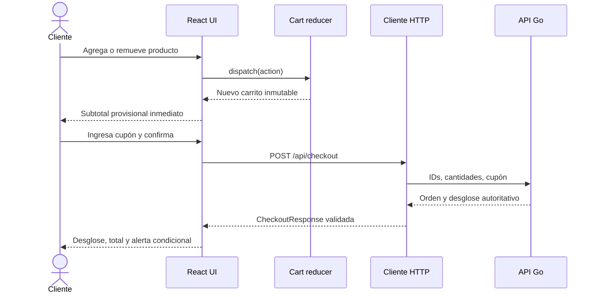
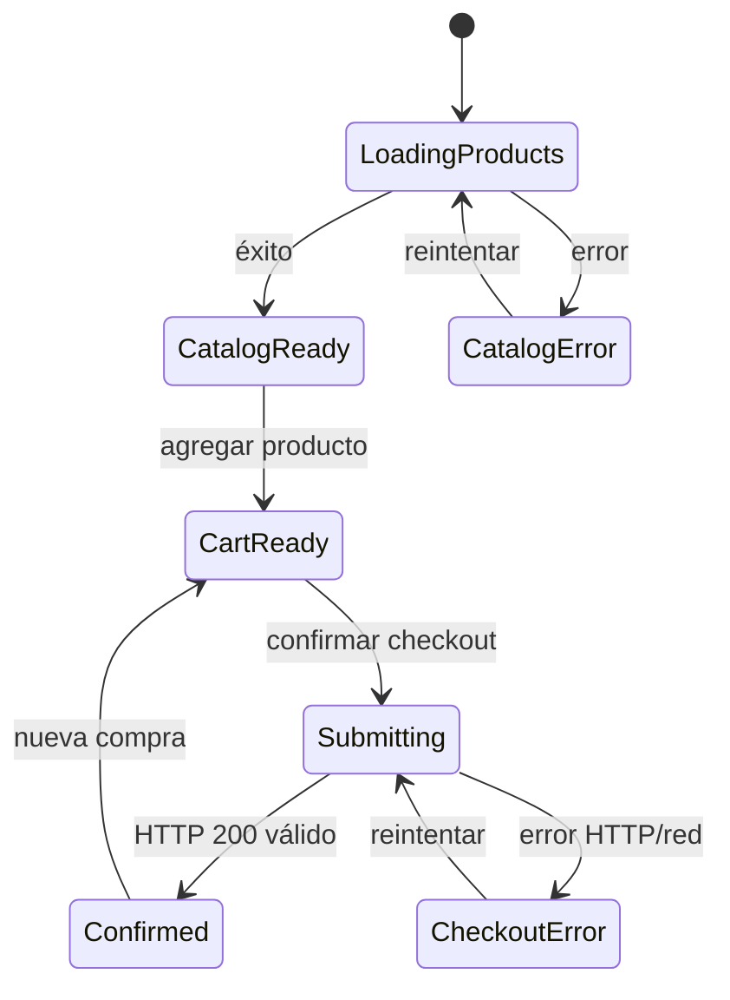

# Plan de implementación frontend - React, estado y UI

## Control del documento

| Campo | Valor |
|---|---|
| Estado | Planificado con dependencias contractuales |
| Aplicación | `apps/frontend` |
| Stack | React + TypeScript + Vite |
| Estrategia de estado | React Context + `useReducer` |
| Especificación técnica | [`frontend-specification.md`](./frontend-specification.md) |
| Plan backend | [`adapters-implementation-plan.md`](../../backend/docs/adapters-implementation-plan.md) |
| Especificación de producto | [`product-specification.md`](../../../docs/specs/product-specification.md) |
| Historias de usuario | [`user-stories.md`](../../../docs/specs/user-stories.md) |

## 1. Objetivo

Construir la interfaz reactiva del MVP de e-commerce dentro de `apps/frontend/`, consumiendo el backend local y manteniendo una separación explícita entre:

- Estado local del carrito.
- Datos autoritativos del backend.
- Estado remoto de cotización y checkout.
- Estado visual efímero.

El resultado debe permitir consultar productos, gestionar el carrito, aplicar un cupón, procesar el checkout, mostrar el desglose completo y renderizar la alerta del límite cuando el backend lo indique.

La implementación debe usar TypeScript estricto sin `any`, actualizaciones inmutables y pruebas que validen comportamiento observable.

## 2. Decisiones técnicas

### 2.1 Estado global: Context + reducer

Para una única pantalla de checkout, React Context combinado con `useReducer` es suficiente y evita añadir una dependencia de estado global.

Decisión:

- `CartStateContext` expone estado de solo lectura.
- `CartDispatchContext` expone acciones.
- `cartReducer` concentra transiciones inmutables.
- Selectores puros calculan cantidades y subtotal.
- No se almacenará el subtotal como dato mutable porque puede derivarse del carrito y el catálogo.

Zustand solo debería introducirse si aparecen múltiples pantallas independientes, persistencia compleja o evidencia de problemas reales con Context.

### 2.2 Backend como fuente de verdad

- El frontend calcula únicamente el subtotal provisional para respuesta inmediata.
- El backend calcula descuentos, ahorro, porcentaje y total final.
- El request solo incluye IDs, cantidades y cupón.
- La UI nunca envía precios ni descuentos como valores autoritativos.
- El checkout definitivo reemplaza cualquier cotización anterior.

### 2.3 Arquitectura por funcionalidades

Los componentes, hooks y modelos se agrupan por capacidad de negocio. Los contratos requeridos explícitamente por el prompt viven en `src/types/`; la lógica de cada feature permanece colocada cerca de su UI.

### 2.4 Sin Effects innecesarios

- El subtotal se deriva durante render o mediante un selector.
- Las acciones del carrito ocurren en event handlers.
- Cotizar y confirmar ocurren al enviar formularios.
- Los Effects se reservan para sincronizar con la API u otros sistemas externos.
- Una cotización obsoleta se detecta comparando su huella con la entrada actual, no mediante un Effect que copie estado.

## 3. Dependencias y bloqueos previos

### 3.1 Backend operativo

Antes de integrar la UI deben estar disponibles:

- `GET /health`.
- `POST /api/checkout`.
- CORS para `http://localhost:5173`.
- Contrato estable de request, response y errores.

### 3.2 Fuente del catálogo

El prompt frontend exige una lista de productos preconfigurados, pero el prompt backend anterior solo exige health y checkout. Se debe aprobar una fuente antes de desarrollar HU-01.

Opciones:

1. **Recomendada:** agregar `GET /api/products` al backend para que el catálogo y stock provengan de la misma fuente autoritativa.
2. Usar temporalmente `src/data/products.ts` con exactamente los mismos IDs del seed backend.

La segunda opción duplica datos y permite divergencias de precio o stock. Si se usa por tiempo, debe documentarse como deuda y el backend seguirá recalculando todo al confirmar.

### 3.3 Contrato de checkout

Se debe confirmar que `POST /api/checkout` retorna:

- `orderId` y `status`.
- Líneas confirmadas.
- Estado del cupón.
- `originalSubtotal`.
- `categoryDiscount`.
- `volumeDiscount`.
- `couponDiscount`.
- `calculatedSavings`.
- `maximumSavings`.
- `finalSavings`.
- `effectiveDiscountPercentage`.
- `limitApplied`.
- `finalTotal`.
- `currency`.

### 3.4 Bloqueo de HU-04

Con las reglas actuales, el descuento máximo es 27.325%. La UI puede implementar y probar el estado `limitApplied = true`, pero la demostración real del 35% permanece bloqueada hasta resolver DR-01.

### 3.5 Política monetaria

Todos los importes del contrato se expresan en centavos enteros. El frontend no aplica redondeo de descuentos; solo formatea importes con `Intl.NumberFormat`.

## 4. Resultado estructural esperado

```text
apps/frontend/
├── src/
│   ├── app/
│   │   ├── App.tsx
│   │   ├── AppErrorBoundary.tsx
│   │   └── config.ts
│   ├── pages/
│   │   └── checkout/
│   │       ├── CheckoutPage.tsx
│   │       └── CheckoutPage.module.css
│   ├── types/
│   │   ├── product.ts
│   │   ├── cart.ts
│   │   ├── checkout.ts
│   │   ├── api-error.ts
│   │   └── index.ts
│   ├── features/
│   │   ├── catalog/
│   │   │   ├── api/getProducts.ts
│   │   │   ├── model/useProducts.ts
│   │   │   └── ui/ProductList.tsx
│   │   ├── cart/
│   │   │   ├── model/cartReducer.ts
│   │   │   ├── model/cartSelectors.ts
│   │   │   ├── model/CartProvider.tsx
│   │   │   ├── model/useCart.ts
│   │   │   └── ui/CartSummary.tsx
│   │   └── checkout/
│   │       ├── api/submitCheckout.ts
│   │       ├── model/useCheckout.ts
│   │       ├── ui/CouponForm.tsx
│   │       ├── ui/CheckoutPanel.tsx
│   │       ├── ui/DiscountBreakdownView.tsx
│   │       ├── ui/DiscountLimitAlert.tsx
│   │       └── ui/OrderConfirmation.tsx
│   ├── shared/
│   │   ├── api/httpClient.ts
│   │   ├── lib/formatMoney.ts
│   │   ├── lib/requestFingerprint.ts
│   │   ├── ui/Alert.tsx
│   │   ├── ui/Button.tsx
│   │   └── styles/tokens.css
│   ├── test/
│   │   ├── handlers.ts
│   │   ├── server.ts
│   │   └── renderApp.tsx
│   ├── main.tsx
│   └── setupTests.ts
├── package.json
├── tsconfig.app.json
├── vite.config.ts
└── vitest.config.ts
```

Crear únicamente archivos necesarios. La arquitectura se demuestra mediante dependencias claras y pruebas, no mediante carpetas vacías.

## 5. Flujo objetivo



## 6. Secuencia de ejecución

### 6.1 Compuerta 0 - Aprobar integración

#### Actividades

- [ ] Confirmar que el backend arranca localmente.
- [ ] Confirmar la URL base y puerto.
- [ ] Confirmar CORS para Vite.
- [ ] Confirmar la fuente de productos.
- [ ] Obtener un ejemplo real de request y response de checkout.
- [ ] Confirmar el envelope de errores.
- [ ] Confirmar si el backend requiere `Idempotency-Key`.
- [ ] Confirmar la semántica de cupón inválido o expirado.
- [ ] Mantener DR-01 visible para la alerta del 35%.

#### Prueba de contrato manual

```bash
curl -i http://localhost:8080/health
```

```bash
curl -i \
  -X POST http://localhost:8080/api/checkout \
  -H 'Content-Type: application/json' \
  -d '{
    "items": [
      { "productId": "tech-001", "quantity": 1 }
    ],
    "couponCode": "WELCOME2026"
  }'
```

#### Criterio de salida

- La UI puede construir su contrato sin inventar nombres o tipos.
- La fuente de catálogo está decidida.
- Existe una respuesta representativa para pruebas MSW.

No iniciar la integración HTTP si esta compuerta falla. El reducer y los componentes puros sí pueden desarrollarse con fixtures contractuales aprobados.

### 6.2 Paso 1 - Configurar calidad y entorno

#### TypeScript estricto

Actualizar `tsconfig.app.json`:

```json
{
  "compilerOptions": {
    "strict": true,
    "noUncheckedIndexedAccess": true,
    "exactOptionalPropertyTypes": true,
    "noImplicitOverride": true,
    "noFallthroughCasesInSwitch": true,
    "noUnusedLocals": true,
    "noUnusedParameters": true,
    "useUnknownInCatchVariables": true
  }
}
```

Reglas:

- [ ] Cero usos de `any`.
- [ ] No usar `as CheckoutResponse` para confiar ciegamente en JSON.
- [ ] Errores capturados como `unknown`.
- [ ] Estados asíncronos con uniones discriminadas.
- [ ] Switches exhaustivos con función `assertNever`.

#### Dependencias de desarrollo

Conservar Vitest y React Testing Library. Añadir solo lo necesario:

```bash
npm install --save-dev @testing-library/user-event msw @vitest/coverage-v8
npm install zod
```

Uso:

- `zod`: validación runtime en la frontera HTTP.
- `msw`: simular API sin acoplar tests a `fetch`.
- `user-event`: interacción realista del usuario.
- `coverage-v8`: umbrales de cobertura.

#### Scripts

Agregar o validar:

```json
{
  "scripts": {
    "dev": "vite",
    "build": "tsc -b && vite build",
    "typecheck": "tsc -b --pretty false",
    "lint": "oxlint",
    "test": "vitest run",
    "test:coverage": "vitest run --coverage"
  }
}
```

#### Entorno

```text
VITE_API_BASE_URL=http://localhost:8080
```

Crear `.env.example`, no versionar secretos y validar la variable en `src/app/config.ts`.

#### Criterio de salida

- `npm run typecheck`, lint, test y build tienen comandos separados.
- TypeScript estricto está activo.
- La suite MSW puede interceptar requests en pruebas.

### 6.3 Paso 2 - Definir tipos y validadores

#### `Product`

```ts
export type Currency = 'USD'
export type Category = 'TECHNOLOGY' | 'HOME' | 'BOOKS'

export interface Product {
  id: string
  name: string
  unitPrice: number
  currency: Currency
  category: Category
  stock: number
}
```

#### `CartItem`

```ts
export interface CartItem {
  productId: string
  quantity: number
}
```

No duplicar nombre, categoría o precio dentro del carrito local. Estos se resuelven desde el catálogo por ID.

#### `DiscountBreakdown`

```ts
export interface DiscountBreakdown {
  originalSubtotal: number
  categoryDiscount: number
  afterCategory: number
  volumeDiscount: number
  afterVolume: number
  couponDiscount: number
  calculatedSavings: number
  maximumSavings: number
  finalSavings: number
  effectiveDiscountPercentage: number
  limitApplied: boolean
  finalTotal: number
  currency: Currency
}
```

#### `CheckoutResponse`

```ts
export type CouponStatus =
  | 'APPLIED'
  | 'NOT_FOUND'
  | 'EXPIRED'
  | 'OMITTED'

export interface CheckoutResponse {
  orderId: string
  status: 'CONFIRMED'
  items: readonly ConfirmedItem[]
  coupon: {
    code: string | null
    status: CouponStatus
  }
  breakdown: DiscountBreakdown
}
```

#### Request

```ts
export interface CheckoutRequest {
  items: readonly CartItem[]
  couponCode?: string
}
```

No incluir `unitPrice`, subtotal ni descuentos en el request.

#### Validación runtime

- [ ] Crear esquemas Zod equivalentes para respuestas externas.
- [ ] Validar que los centavos sean enteros seguros no negativos.
- [ ] Validar cantidades enteras.
- [ ] Validar literales de moneda, categoría, estado y cupón.
- [ ] Convertir fallos de esquema en `INVALID_RESPONSE`.
- [ ] Probar respuestas válidas, incompletas y con tipos erróneos.

#### Criterio de salida

- Los cuatro tipos solicitados existen en `src/types/`.
- El código no utiliza `any`.
- El cliente HTTP nunca retorna JSON sin validar.

### 6.4 Paso 3 - Implementar estado global del carrito

#### Estado

```ts
export interface CartState {
  readonly itemsByProductId: Readonly<Record<string, CartItem>>
  readonly revision: number
}
```

#### Acciones

```ts
export type CartAction =
  | { type: 'itemAdded'; productId: string; knownStock: number }
  | { type: 'itemDecremented'; productId: string }
  | { type: 'itemRemoved'; productId: string }
  | { type: 'cartCleared' }
```

#### Invariantes

- Cantidades enteras mayores que cero.
- Una única línea por `productId`.
- Nunca superar el stock conocido.
- No mutar el estado o las acciones recibidas.
- Incrementar `revision` únicamente cuando el carrito cambia.
- Una acción rechazada devuelve el mismo estado.

#### Selectores

```ts
selectItems(state): readonly CartItem[]
selectTotalUnits(state): number
selectOriginalSubtotal(state, products): number
selectCanCheckout(state): boolean
```

`selectOriginalSubtotal` suma `unitPrice * quantity` en centavos. El subtotal no forma parte de `CartState` para evitar inconsistencias.

#### Provider y hooks

- [ ] Crear `CartProvider`.
- [ ] Separar contextos de estado y dispatch.
- [ ] Crear `useCartState()` y `useCartDispatch()` que fallen con mensaje claro fuera del provider.
- [ ] No exponer setters genéricos; solo acciones de dominio.

#### Pruebas del reducer

- [ ] Agregar primera unidad.
- [ ] Incrementar una línea existente.
- [ ] Reducir cantidad.
- [ ] Eliminar última unidad.
- [ ] Eliminar línea completa.
- [ ] Impedir superar stock.
- [ ] Conservar inmutabilidad.
- [ ] Mantener la misma referencia ante una acción inválida.
- [ ] Calcular subtotal de uno y varios productos.
- [ ] Carrito vacío produce cero.
- [ ] Switch exhaustivo.

#### Criterio de salida

- Estado y selectores tienen pruebas aisladas.
- El subtotal cambia sin Effects.
- Ningún componente necesita conocer la estructura interna del reducer.

### 6.5 Paso 4 - Construir catálogo y gestión visual del carrito

#### Fuente de productos

Si existe `GET /api/products`:

- Crear `getProducts()` y `useProducts()`.
- Modelar estados `idle`, `loading`, `success` y `error`.
- Cancelar la solicitud al desmontar o ignorar respuestas obsoletas.

Si se aprueba fixture temporal:

- Crear `src/data/products.ts` con IDs idénticos al backend.
- Marcarlo con una decisión técnica y una tarea de reemplazo.
- No tratar precio o stock del fixture como definitivo al confirmar.

#### `ProductList`

- [ ] Mostrar nombre, categoría, precio y stock.
- [ ] Utilizar lista semántica.
- [ ] Botón Agregar con nombre accesible específico.
- [ ] Deshabilitar cuando stock conocido sea cero o esté agotado por el carrito.
- [ ] Mostrar loading, catálogo vacío y error con reintento.

#### `CartSummary`

- [ ] Mostrar líneas, cantidades y subtotal provisional.
- [ ] Permitir incrementar, reducir y eliminar.
- [ ] Mostrar controles con nombres accesibles por producto.
- [ ] Deshabilitar Confirmar con carrito vacío.
- [ ] Comunicar cambios de subtotal mediante una región `aria-live="polite"`.
- [ ] Indicar claramente que el total definitivo se calcula al confirmar.

#### Formato monetario

```ts
const usdFormatter = new Intl.NumberFormat('es-CO', {
  style: 'currency',
  currency: 'USD',
  minimumFractionDigits: 2,
})

export function formatCents(cents: number): string {
  if (!Number.isSafeInteger(cents)) {
    throw new Error('Invalid cents value')
  }
  return usdFormatter.format(cents / 100)
}
```

#### Pruebas

- [ ] Renderiza catálogo.
- [ ] Agrega, incrementa, reduce y elimina mediante interacción real.
- [ ] Actualiza subtotal inmediatamente.
- [ ] Respeta stock conocido.
- [ ] Permite operar completamente con teclado.
- [ ] Estados loading, vacío, error y reintento.

#### Criterio de salida

- Se cumplen CA-HU01-01 a CA-HU01-05.
- La UI usa el store mediante hooks y no muta objetos.

### 6.6 Paso 5 - Implementar checkout y desglose

#### Cliente HTTP

Crear `shared/api/httpClient.ts` con estas responsabilidades:

- Resolver `VITE_API_BASE_URL`.
- Enviar y aceptar JSON.
- Aplicar timeout con `AbortController`.
- Diferenciar error de red, aborto, HTTP y schema inválido.
- Decodificar el envelope de error.
- Retornar datos ya validados.

No debe importar React ni mostrar mensajes.

#### Formulario

- Usar `<form>` para permitir submit con Enter.
- Input con label visible.
- Normalizar visualmente con `trim`; el backend mantiene la normalización autoritativa.
- Deshabilitar submit con carrito vacío o durante una solicitud.
- Evitar doble submit.
- Conservar el carrito después de errores recuperables.

#### Request

```json
{
  "items": [
    { "productId": "tech-001", "quantity": 1 }
  ],
  "couponCode": "WELCOME2026"
}
```

- Ordenar líneas por `productId` para obtener una representación determinista.
- Omitir `couponCode` si queda vacío después de `trim`.
- Si el backend exige `Idempotency-Key`, conservar la misma clave durante reintentos de la misma intención.

#### Estado asíncrono

```ts
export type CheckoutState =
  | { status: 'idle' }
  | { status: 'submitting' }
  | { status: 'success'; data: CheckoutResponse }
  | { status: 'error'; error: ApiError; retryable: boolean }
```

No usar booleanos independientes como `isLoading`, `hasError` e `isSuccess` que permitan estados contradictorios.

#### `DiscountBreakdownView`

Orden visual:

1. Subtotal original.
2. Descuento de categoría.
3. Descuento por volumen.
4. Descuento por cupón.
5. Ahorro total.
6. Porcentaje efectivo.
7. Total final.

Mostrar conceptos con valor cero para conservar transparencia. El componente formatea datos; no recalcula reglas.

#### Errores

| Código | Tratamiento de UI |
|---|---|
| `EMPTY_CART` | Indicar que debe agregarse un producto. |
| `INVALID_QUANTITY` | Identificar la línea que debe corregirse. |
| `PRODUCT_NOT_FOUND` | Informar indisponibilidad y refrescar catálogo. |
| `INSUFFICIENT_STOCK` | Mostrar disponible vs. solicitado; conservar el resto del carrito. |
| `SERVICE_UNAVAILABLE` | Conservar datos y permitir reintentar. |
| `NETWORK_ERROR` | Mostrar problema de conexión y reintentar. |
| `INVALID_RESPONSE` | Mensaje seguro y request ID para soporte. |
| `INTERNAL_ERROR` | Mensaje genérico; no mostrar detalles internos. |

No usar un toast efímero como único lugar para errores que requieren una acción.

#### Pruebas

- [ ] Envía IDs, cantidades y cupón; no envía precios.
- [ ] Deshabilita submit durante la solicitud.
- [ ] Renderiza el desglose completo.
- [ ] Muestra cupón aplicado, no encontrado y expirado.
- [ ] Presenta errores de stock y red de forma accionable.
- [ ] Conserva carrito ante error recuperable.
- [ ] Una respuesta inválida no se renderiza como éxito.

#### Criterio de salida

- Se cumplen los criterios frontend de HU-02 y HU-03.
- El resultado backend es la única fuente de descuentos definitivos.

### 6.7 Paso 6 - Implementar alerta reactiva del límite

#### Contrato

La condición debe ser exclusivamente:

```ts
checkout.status === 'success' &&
checkout.data.breakdown.limitApplied === true
```

No comparar `effectiveDiscountPercentage >= 35` porque el porcentaje puede estar redondeado y no comunica si hubo truncamiento.

#### Componente

```tsx
<DiscountLimitAlert
  visible={checkout.data.breakdown.limitApplied}
/>
```

Texto exacto:

```text
¡Enhorabuena! Has alcanzado el límite máximo de ahorro permitido (35%)
```

Requisitos:

- [ ] Visualmente distintiva sin depender solo del color.
- [ ] Semántica accesible mediante `role="status"` o `role="alert"` según la urgencia aprobada.
- [ ] Persistente mientras la respuesta de checkout sea la vigente.
- [ ] No incluir botón de cierre si su cierre ocultaría el estado requerido.
- [ ] Desaparecer al iniciar una nueva compra o recibir una respuesta vigente sin límite.

#### Pruebas críticas

- [ ] Aparece cuando `limitApplied` es verdadero.
- [ ] No aparece cuando es falso.
- [ ] El texto coincide exactamente.
- [ ] Permanece después de rerenders no relacionados.
- [ ] Desaparece cuando cambia el resultado vigente.
- [ ] Se localiza por rol y nombre, no por clase CSS.

#### Bloqueo funcional

El componente puede implementarse con fixtures, pero HU-04 no puede validarse contra las reglas reales hasta resolver DR-01.

#### Criterio de salida

- La lógica condicional está cubierta al 100% en ramas.
- La documentación conserva visible el bloqueo matemático.

### 6.8 Paso 7 - Integración, UX y accesibilidad

#### Composición

```text
App
└── CartProvider
    └── CheckoutPage
        ├── ProductList
        ├── CartSummary
        └── CheckoutPanel
            ├── CouponForm
            ├── DiscountBreakdownView
            ├── DiscountLimitAlert
            └── OrderConfirmation
```

#### Accesibilidad

- [ ] HTML semántico antes que ARIA.
- [ ] Flujo completo operable por teclado.
- [ ] Foco visible.
- [ ] Labels asociados a controles.
- [ ] Errores relacionados mediante `aria-describedby`.
- [ ] Cambios no críticos con `aria-live="polite"`.
- [ ] No depender solo del color.
- [ ] Contraste AA.
- [ ] Foco en la confirmación después de un checkout exitoso.
- [ ] Respetar `prefers-reduced-motion`.

#### Responsive

- Mobile-first.
- Una columna en pantallas pequeñas.
- Dos columnas para catálogo y checkout en pantallas amplias.
- Controles táctiles con tamaño suficiente.
- No depender de hover.
- Resumen sticky solo si no perjudica teclado o lectura.

#### Estilos

Elegir una estrategia única. Recomendación: CSS Modules + tokens CSS. Si se adopta Tailwind, documentarlo y retirar estilos o dependencias no utilizados; no mezclar estrategias sin justificación.

#### Criterio de salida

- El flujo es usable en móvil, escritorio y teclado.
- Los estados de carga y error no producen layout roto o acciones ambiguas.

### 6.9 Paso 8 - Cobertura y pruebas integradas

#### Configuración de cobertura

Umbral mínimo para lógica esencial:

```ts
coverage: {
  provider: 'v8',
  thresholds: {
    lines: 80,
    functions: 80,
    branches: 80,
    statements: 80,
  },
}
```

El umbral global no sustituye el requisito: `cartReducer`, selectores y `DiscountLimitAlert` deben superar individualmente el 80% y cubrir todas sus ramas críticas.

#### Pirámide

1. Unitarias: reducer, selectores, formatters y validadores.
2. Componentes: catálogo, carrito, formulario, desglose y alerta.
3. Integración con MSW: flujo completo contra contratos HTTP simulados.
4. E2E opcional: navegador + backend real, si el tiempo lo permite.

#### Casos MSW

- [ ] Catálogo exitoso, vacío y error.
- [ ] Checkout exitoso sin cupón.
- [ ] `WELCOME2026` aplicado.
- [ ] Cupón inválido o expirado.
- [ ] Stock insuficiente.
- [ ] Error 500 y error de red.
- [ ] Respuesta con schema inválido.
- [ ] `limitApplied` verdadero y falso.

#### Principios de pruebas

- Consultar por rol, label y texto que ve el usuario.
- Usar `user-event` en lugar de invocar handlers directamente.
- Evitar snapshots grandes como prueba principal.
- No probar nombres de clases o estructura interna del reducer.
- No mockear hooks propios si puede ejercitarse el flujo real con MSW.

#### Criterio de salida

- `npm run test:coverage` pasa con umbrales.
- No existen pruebas triviales que solo aumenten cobertura.
- Los errores de red y dominio tienen comportamiento observable comprobado.

### 6.10 Paso 9 - Verificación final

Ejecutar secuencialmente:

```bash
npm run lint
npm run typecheck
npm run test:coverage
npm run build
```

Arranque esperado:

```bash
cd apps/frontend
VITE_API_BASE_URL=http://localhost:8080 npm run dev
```

Validación manual:

- [ ] El catálogo se muestra.
- [ ] Agregar/remover actualiza subtotal inmediatamente.
- [ ] El carrito impide superar el stock conocido.
- [ ] El cupón se envía en checkout.
- [ ] El desglose muestra todos los conceptos.
- [ ] El error de stock conserva el carrito.
- [ ] No se puede enviar dos veces mientras procesa.
- [ ] La alerta aparece con un fixture `limitApplied = true`.
- [ ] El flujo funciona con teclado.
- [ ] No hay errores de consola.
- [ ] Build de producción funciona.

## 7. Estado de UI



Estados imposibles deben evitarse mediante uniones discriminadas. Por ejemplo, una solicitud no puede estar simultáneamente en carga y éxito.

## 8. Matriz de trazabilidad

| Requisito del prompt | Paso | Evidencia |
|---|---|---|
| Tipos en `src/types/` | 2 | Interfaces y validadores. |
| Sin `any` | 1 y 2 | Typecheck estricto y lint. |
| Store global | 3 | Provider, reducer y hooks. |
| Estado inmutable | 3 | Tests de referencias y transiciones. |
| Subtotal inmediato | 3 y 4 | Selector y pruebas de interacción. |
| Lista de productos | 4 | `ProductList` y fuente aprobada. |
| Agregar/remover | 3 y 4 | Reducer + `CartSummary`. |
| Input de cupón | 5 | Formulario accesible. |
| `POST /api/checkout` | 5 | Cliente HTTP y pruebas MSW. |
| Desglose completo | 5 | `DiscountBreakdownView`. |
| Alerta persistente | 6 | Componente y pruebas condicionales. |
| 80% de cobertura | 8 | Reporte V8 y thresholds. |

## 9. Riesgos y mitigaciones

| Riesgo | Impacto | Mitigación |
|---|---|---|
| Backend sin catálogo | La UI no conoce productos válidos | Aprobar `GET /api/products` o fixture temporal explícito. |
| Contratos frontend/backend divergentes | Fallos en integración | Tipos, validación runtime, fixtures y Compuerta 0. |
| Subtotal duplicado en estado | Valores desincronizados | Derivarlo mediante selector. |
| Respuesta remota sin validar | Pantallas rotas | Zod en frontera HTTP. |
| Doble submit | Órdenes duplicadas | Estado submitting + idempotencia backend. |
| Stock visual desactualizado | Falsa expectativa | Etiquetar como conocido y manejar `INSUFFICIENT_STOCK`. |
| Alerta del 35% inalcanzable | Demo incompleta | Resolver DR-01; probar UI con fixture mientras tanto. |
| Tests acoplados a implementación | Refactors costosos | Testing Library por comportamiento. |
| Context provoca renders amplios | Rendimiento | Separar estado/dispatch y medir antes de optimizar. |
| Mezcla de CSS/Tailwind | Estilos inconsistentes | Adoptar una única estrategia. |

## 10. Estrategia de commits

1. `docs(frontend): add implementation plan`
2. `chore(frontend): enable strict types and test tooling`
3. `feat(frontend): add typed api contracts and validators`
4. `feat(frontend): add immutable cart store and selectors`
5. `test(frontend): cover cart state transitions`
6. `feat(frontend): add product list and cart ui`
7. `feat(frontend): integrate checkout and breakdown`
8. `feat(frontend): add maximum discount alert`
9. `test(frontend): cover checkout and conditional alert`
10. `docs: add integrated demo flow to README`

Cada commit debe compilar y mantener pruebas verdes.

## 11. Apoyo visual para la sustentación

Sí, es recomendable incluir apoyo visual breve en el README. La sustentación dispone de poco tiempo y dos diagramas reducen explicación verbal repetitiva:

1. **Diagrama de secuencia integrado:** Cliente -> React -> CheckoutService -> repositorio -> respuesta.
2. **Diagrama de estados de UI:** catálogo, carrito, envío, error y confirmación.

Recomendación de README:

- Mantener cada diagrama en Mermaid para versionarlo como texto.
- Colocarlos después de una sección `Arquitectura en 60 segundos`.
- Incluir enlaces a las especificaciones detalladas en lugar de duplicarlas.
- Añadir debajo de cada diagrama dos o tres decisiones clave.
- Evitar diagramas con detalles de clases o archivos; deben poder explicarse en menos de un minuto.

El diagrama de secuencia de la sección 5 y la máquina de estados de la sección 7 pueden reutilizarse como base cuando se actualice el README.

## 12. Definition of Ready

La implementación puede comenzar cuando:

- [ ] El backend levanta localmente y responde `/health`.
- [ ] `POST /api/checkout` tiene contrato aprobado.
- [ ] Se definió la fuente de productos.
- [ ] CORS permite el origen de Vite.
- [ ] Los errores esperados tienen códigos estables.
- [ ] Se confirmó si checkout exige idempotency key.
- [ ] Fixtures MSW representan respuestas reales.
- [ ] DR-01 permanece documentada como bloqueo o fue resuelta.

## 13. Definition of Done

La fase frontend está terminada cuando:

- [ ] Los contratos solicitados existen en `src/types/` y se validan en runtime.
- [ ] TypeScript estricto pasa sin `any`.
- [ ] Context + reducer administran el carrito de forma inmutable.
- [ ] El subtotal provisional se deriva y actualiza inmediatamente.
- [ ] Productos se agregan, incrementan, reducen y eliminan respetando stock conocido.
- [ ] Checkout consume `POST /api/checkout` sin enviar precios.
- [ ] El desglose autoritativo muestra todos los conceptos requeridos.
- [ ] La alerta usa `limitApplied` y el texto exacto.
- [ ] Errores de red, validación y stock son accionables.
- [ ] El flujo funciona con teclado y cumple los criterios de accesibilidad definidos.
- [ ] Lint, typecheck, cobertura y build pasan.
- [ ] Reducer, selectores y alerta superan el 80% de cobertura y cubren sus ramas críticas.
- [ ] README contiene comandos de ejecución y los dos diagramas de apoyo.

## 14. Comando de arranque esperado

Con el backend disponible en `http://localhost:8080`:

```bash
cd apps/frontend && VITE_API_BASE_URL=http://localhost:8080 npm run dev
```

La creación de este plan no implica que la implementación o sus pruebas ya estén finalizadas.
