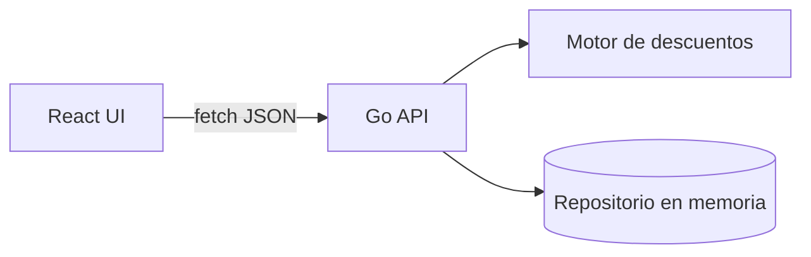
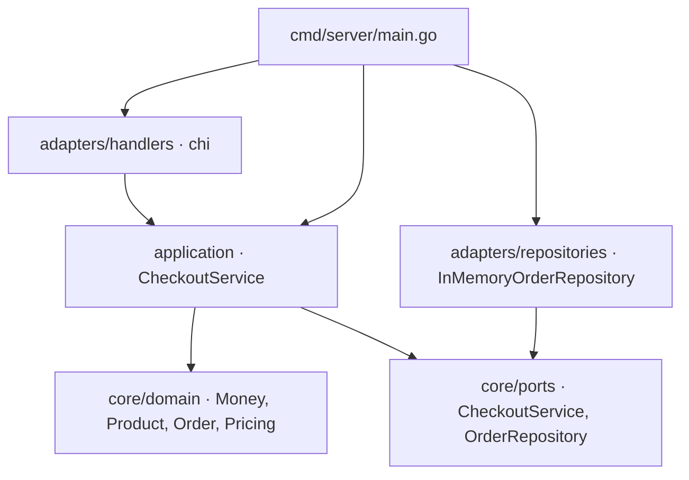

# Arquitectura

Este documento resume las decisiones arquitectónicas reales del monorepo `examen-ecommerce`, tal como quedaron implementadas en `apps/backend` y `apps/frontend`. Para el detalle funcional y los contratos HTTP, ver [`docs/specs/product-specification.md`](specs/product-specification.md), [`apps/backend/docs/backend-specification.md`](../apps/backend/docs/backend-specification.md) y [`apps/frontend/docs/frontend-specification.md`](../apps/frontend/docs/frontend-specification.md).

## 1. Visión general

- **Backend** (`apps/backend`): Go, arquitectura hexagonal (puertos y adaptadores). Única fuente de verdad para catálogo, precios, stock, cupones y totales.
- **Frontend** (`apps/frontend`): React + TypeScript estricto. Gestiona la intención de compra y la presentación; nunca recalcula descuentos, solo muestra lo que el backend devuelve.
- Comunicación por HTTP/JSON, sin autenticación, sin base de datos externa (MVP en memoria).

## 2. Arquitectura del backend

Reglas de dependencia:

- `core/domain` no importa nada fuera de la librería estándar: sin tags JSON, sin SQL, sin HTTP.
- `core/ports` define las interfaces que consumen `application` (entrada) y que implementan `adapters` (salida). Los adaptadores dependen de los puertos, nunca al revés.
- `cmd/server/main.go` es el único *composition root*: ahí se construyen `zap`, `envconfig`, el repositorio, el caso de uso y los handlers, y se inyectan por constructor. No existen variables globales ni singletons.
- El handler HTTP no calcula descuentos ni decide reglas de negocio; solo decodifica, valida forma y traduce errores a códigos HTTP.
- El repositorio no calcula descuentos; solo valida stock, decrementa y persiste bajo un único lock de escritura (atomicidad).

### Motor de descuentos (`internal/pricing`)

El pipeline `category → volume → coupon → cap` es determinista y puro (sin I/O, sin reloj propio, sin persistencia). Cada regla implementa `DiscountRule`, y el `Engine` las aplica en orden fijo, acumulando el total intermedio.

## 3. Arquitectura del frontend

- Organización **por features** (`catalog`, `cart`, `checkout`) en vez de por tipo técnico: cada feature agrupa su API, modelo (hooks/reducer) y UI.
- Estado del carrito: `React Context` + `useReducer`, con contextos de lectura (`CartStateContext`) y escritura (`CartDispatchContext`) separados para evitar renders innecesarios.
- Estado remoto (catálogo, cotización, checkout) modelado con uniones discriminadas (`{status: 'idle'|'loading'|'success'|'error', ...}`) para que no existan combinaciones imposibles (por ejemplo, "cargando y con error" a la vez).
- El subtotal es siempre **derivado** (selector puro sobre carrito + catálogo), nunca un campo de estado duplicado.
- Frontera HTTP validada en runtime con **Zod**: ninguna respuesta del backend se trata como confiable sin pasar por un schema.

## 4. Patrones de diseño implementados

El enunciado exige al menos dos patrones de diseño explícitos; se implementaron los siguientes:

1. **Strategy** (`internal/pricing/rule.go`): cada descuento (`CategoryRule`, `VolumeRule`, `CouponRule`, `CapRule`) implementa la interfaz `DiscountRule` con su propio algoritmo, intercambiable sin tocar el motor.
2. **Chain of Responsibility** (`internal/pricing/engine.go`): el `Engine` encadena las estrategias anteriores en un orden fijo y obligatorio, donde la salida de una regla es la entrada de la siguiente.
3. **Repository** (`internal/core/ports.OrderRepository` + `internal/adapters/repositories.InMemoryOrderRepository`): el caso de uso depende de una interfaz de persistencia, no de una implementación concreta; permite sustituir el adaptador en memoria por uno con base de datos sin tocar `application` ni `core/domain`.
4. **Dependency Injection por constructor**: en todo el backend (`NewCheckoutService`, `NewCheckoutHandler`, `NewInMemoryOrderRepository`, etc.) las dependencias se reciben explícitamente, sin contenedores de DI ni variables globales.

## 5. Trade-offs

| Decisión | Alternativa descartada | Motivo |
|---|---|---|
| Persistencia en memoria (`sync.RWMutex` + mapas) | SQLite (`database/sql`) | `apps/backend/docs/adapters-implementation-plan.md` prioriza tener un checkout atómico y probado con `-race` primero; SQLite queda como adaptador futuro detrás del mismo puerto `OrderRepository`, sin cambiar el caso de uso. Se pierde persistencia entre reinicios como limitación conocida y aceptada de esta fase. |
| Rutas `/api/products`, `/api/checkout/quote`, `/api/checkout` | `/api/v1/...` versionado | Se siguió el contrato mínimo necesario para el frontend; versionar después no requiere cambiar el caso de uso, solo el router. |
| `200 OK` en checkout exitoso | `201 Created` | Alineado con el criterio explícito de la fase de adaptadores; queda registrado como deuda contractual frente a `backend-specification.md`, que recomienda `201`. |
| Cliente HTTP con `fetch` + Zod en frontend | Librería de server-state (React Query, SWR) | Con una sola pantalla y tres operaciones remotas, un cliente pequeño y hooks propios son suficientes; no se justifica la dependencia adicional. |
| Context + `useReducer` para el carrito | Redux / Zustand | Mismo argumento: una sola pantalla no requiere una librería de estado global. |
| Cupón único `WELCOME2026` con expiración fija en código | Tabla de cupones configurable | Fuera de alcance del MVP (no hay administración de cupones); se documenta como decisión pendiente (DR-03) en `product-specification.md`. |
| Cobertura de pruebas priorizada en `pricing` (97%) y `application` (93%) sobre `adapters/handlers` (64%) | Cobertura uniforme al 80% en todo | La especificación permite priorizar el motor de descuentos y el caso de uso —donde vive la lógica crítica— por encima de capas de transporte más triviales. |
| Idempotencia solo del lado del cliente (`Idempotency-Key` generado y reenviado en reintentos) | Deduplicación real en el backend | No implementada en esta fase (DR-08 pendiente); el backend actualmente no persiste ni verifica la clave, así que un reintento real generaría una segunda orden. Documentado como limitación conocida. |
| Tope de descuento del 35% (`CapRule`) implementado y probado con porcentajes configurables, sin alterar los porcentajes de producción | Subir los porcentajes de producción para que el 35% sea alcanzable | DR-01 en `product-specification.md` está bloqueada: con 10%/5%/15% el máximo real es 27.325%. Se prefirió dejar la regla de negocio intacta y visible como limitación, en vez de alterarla silenciosamente solo para poder demostrar la alerta. |

## 6. Limitaciones conocidas

- Sin autenticación, pagos, impuestos ni envíos (fuera de alcance del MVP, según `product-specification.md`).
- Sin idempotencia real en checkout (ver tabla de trade-offs).
- HU-04 (alerta de límite de descuento) no es demostrable con datos reales de producción hasta que se resuelva DR-01.
- El catálogo y el stock viven solo en memoria del proceso backend: se reinician al reiniciar el servidor.
